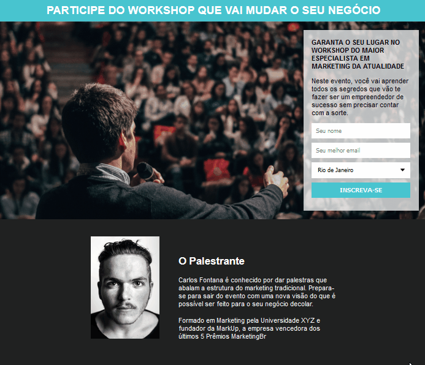

<h1 align="center">
 
  
 
 
Lead Capture Page
</h1>

The purpose of this page is to facilitate a speaker's communication with his listeners.

The page takes the name, email and state of those who subscribe to it and stores it in the mailchimp in a list where the speaker can send a single email to all those registered.

  

[//]: # (Add your gifs/images here:)

  

## Getting started

Just clone the repository and open index.html in a browser ;D

## License

This project is licensed under the MIT License - see the [LICENSE](https://opensource.org/licenses/MIT) page for details.